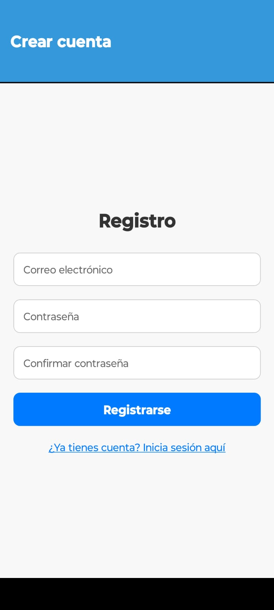
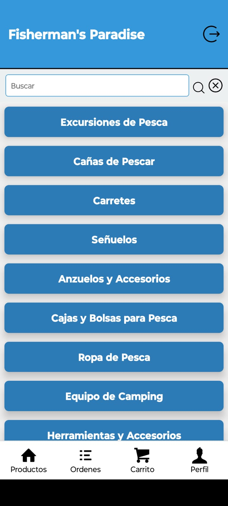
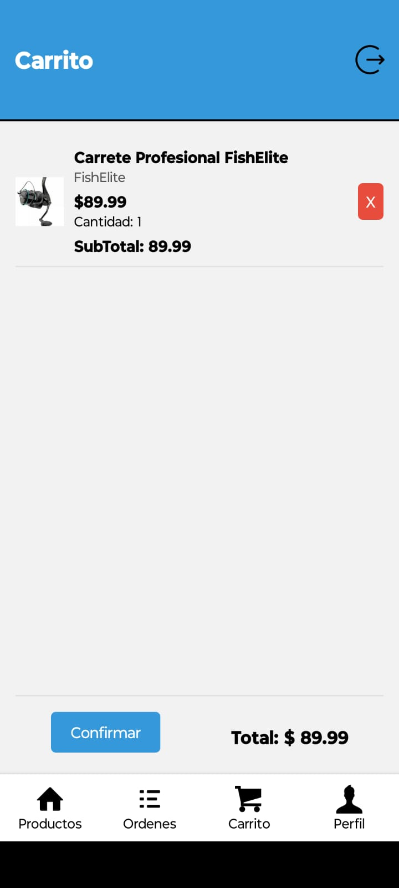
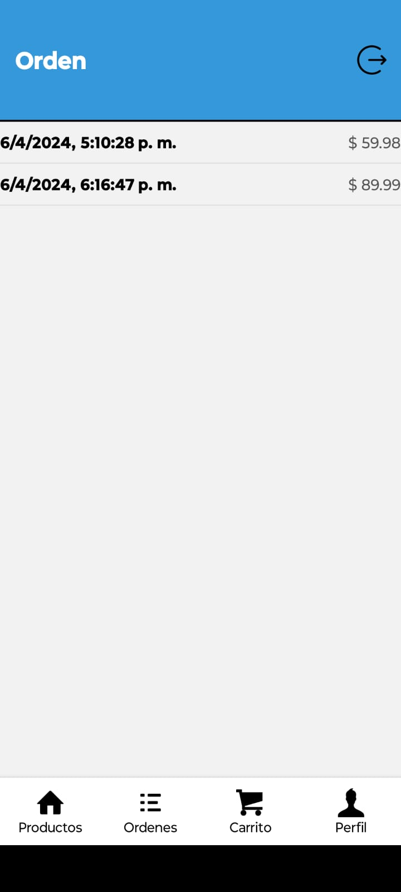

# E-Commerce App - React Native

Una aplicación de comercio electrónico desarrollada con React Native que ofrece una experiencia de compra completa y fácil de usar.

### Pantalla de Cuenta

- **Acceso seguro:** Solo los usuarios autenticados pueden acceder a la pantalla de perfil y realizar compras.
- **Información del usuario:** Muestra detalles del usuario, como nombre y dirección.

### Autenticación con Firebase

- Utiliza el sistema de autenticación de Firebase para gestionar el acceso de usuarios.
- Permite a los usuarios iniciar sesión y registrarse de manera segura.

### Pantalla de Categorías

- Muestra una selección de categorías en tarjetas.
- Al hacer clic en una categoría, se navega a la pantalla de productos correspondiente.

### Pantalla de Productos

- Lista todos los productos en tarjetas con nombre y foto.
- Incluye un buscador para filtrar productos por nombre.
- Al hacer clic en un producto, se navega a la pantalla de detalles del producto.

### Pantalla de Detalles del Producto

- Proporciona una descripción detallada del producto.
- Muestra el precio y el stock disponible.
- Permite agregar el producto al carrito.

### Pantalla Del Carrito

-Muestra los productos agrados al carrito.
-Incluye la opcion de eliminar cierto producto seleccionado del carro.
-Al Hacer Click en Confirmar, esto genera una Orden refiriendose a los productos agregados al carro.

### Pantlla Ordenes

-Muestra Historial de Ordenes de compra. 

## Imagenes Ilustrativas :

- **Pestaña 1 - Productos:** Categorías y productos (stack principal).
- **Pestaña 2 - Carrito:** Detalles del carrito de compras con resumen y botón para finalizar la orden.
- **Pestaña 3 - Órdenes:** Historial de órdenes realizadas.
- **Pestaña 4 - Perfil:** Información del usuario, ubicación y carga de imagen de perfil.

## Tecnologías Utilizadas

- **Firebase Authentication:** Implementa el sistema de autenticación de Firebase para gestionar la seguridad de la aplicación.
- **React Native Navigation Stack:** Gestiona la navegación entre pantallas.
- **React Native Navigation Buttom tap:** Gestiona la navegación entre pestañas.
- **Expo-Location:** Permite acceder y gestionar la ubicación del usuario.
- **Expo-Picker-Image:** Facilita la carga de imágenes de perfil.
- **Redux:** Centraliza y gestiona el estado de la aplicación.
- **RTK Query y Firebase:** Realiza operaciones de lectura/escritura en la base de datos.
  **React Native Animatable:** Para realizar animaciones en los modales.

## Instalación

1. Clona el repositorio: `git clone https://github.com/Lucassammarco/Proyecto-Ecommerce-reactNative-LucasSammarco.git`
2. Instala las dependencias: `npm install`
3. Configura las claves de API para servicios externos (Expo-Location, Firebase, etc.).
4. Configura las credenciales de Firebase en tu proyecto.
5. Ejecuta la aplicación: `npm start`

## Contacto

Para preguntas o soporte, contacta a lucas_sammarco@hotmail.com.